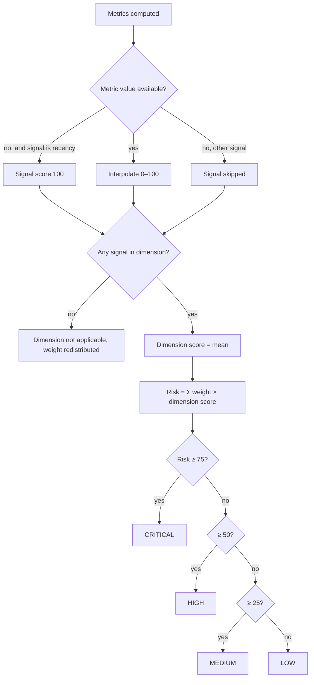

# 06 — Risk Model

**Status:** heuristic, configurable, **not empirically validated**. Source of truth: `backend/app/engines/risk_config.py` and `risk.py`.

## Structure

```
Risk score (0–100)
├── Activity risk            weight 0.25  ← recency, trend, regularity
├── Issue risk               weight 0.20  ← close ratio, open-issue age
├── Pull request risk        weight 0.20  ← turnaround, turnaround trend, stale PRs, PR size
├── Contributor dependency   weight 0.20  ← top-contributor share, bus factor, team size
└── Release risk             weight 0.15  ← time since last release
```

## Calculation

1. **Signal score** — each signal maps its metric value *x* to 0–100 by piecewise-linear interpolation between configured points, clamped at the ends. Example: turnaround points (1 day → 0), (4 → 50), (14 → 100); a 9-day median scores 50 + (9−4)/(14−4)×50 = **75**.
2. **Dimension score** — mean of the signals that have data.
3. **Weight renormalisation** — dimensions with no available signal are *not applicable*; remaining weights are divided by their sum. **Coverage** = sum of applicable weights ÷ sum of all weights.
4. **Risk score** = Σ (normalised weight × dimension score). **Health score** = 100 − risk.
5. **Contribution** of a signal = normalised weight × signal score ÷ number of signals in its dimension. Contributions add up exactly to the risk score (displayed values may differ by ±0.1 from rounding).
6. **Level:** LOW < 25 ≤ MEDIUM < 50 ≤ HIGH < 75 ≤ CRITICAL.
7. **Severity** of a signal: low < 25 ≤ medium < 50 ≤ high < 75 ≤ critical.

### Missing data policy
- A missing metric removes its signal (no guessing), **except** `days_since_last_commit`: no commit in the whole window scores 100, because absence of commits *is* the evidence.
- A project that never published a GitHub Release has Release risk *not applicable* (many healthy projects release via tags or package registries).

## Signal thresholds (defaults)

| Signal | Metric | Points (value → score) | Rationale (heuristic) |
|---|---|---|---|
| activity.recency | days_since_last_commit | 7→0, 30→40, 90→100 | A quarter without commits signals stalled development |
| activity.trend | activity_trend_pct | 0→0, −40→50, −80→100 | Large drop against own baseline |
| activity.regularity | active_weeks_ratio | 0.8→0, 0.5→40, 0.15→100 | Continuous vs bursty work |
| issues.close_ratio | issue_close_ratio_90d | 1.0→0, 0.7→40, 0.3→100 | Backlog growth |
| issues.backlog_age | median_open_issue_age_days | 30→0, 120→50, 365→100 | Untriaged backlog |
| pull_requests.turnaround | median_pr_turnaround_days | 1→0, 4→50, 14→100 | Review bottleneck |
| pull_requests.turnaround_trend | pr_turnaround_trend_pct | 0→0, 50→50, 150→100 | Reviews slowing |
| pull_requests.stale_prs | stale_open_pr_ratio | 0.1→0, 0.4→50, 0.7→100 | Abandoned review work |
| pull_requests.pr_size | median_pr_size_lines | 200→0, 500→50, 1500→100 | Large PRs are harder to review |
| contributors.concentration | top_contributor_share | 0.3→0, 0.6→50, 0.9→100 | Dependency on one person |
| contributors.bus_factor | bus_factor_estimate | 1→100, 2→60, 3→30, 4→0 | Few people carry half the work |
| contributors.team_size | contributors_90d | 1→100, 3→50, 6→0 | Very small active team |
| releases.release_recency | days_since_last_release | 90→0, 180→40, 540→100 | Delivery recency |

## Decision table — risk level

| Condition | R1 | R2 | R3 | R4 |
|---|---|---|---|---|
| score < 25 | Y | N | N | N |
| 25 ≤ score < 50 | – | Y | N | N |
| 50 ≤ score < 75 | – | – | Y | N |
| score ≥ 75 | – | – | – | Y |
| **Action: level** | LOW | MEDIUM | HIGH | CRITICAL |

## Decision table — recommendation priority (per signal)

| Condition | R1 | R2 | R3 |
|---|---|---|---|
| signal score ≥ 75 | Y | N | N |
| 50 ≤ signal score < 75 | – | Y | N |
| signal score < 50 | – | – | Y |
| **Action** | HIGH-priority recommendation | MEDIUM-priority recommendation | No recommendation |

## Decision tree — how one analysis is classified



## Configuring
Copy the structure of `DEFAULT_RISK_CONFIG` into a JSON file and set `RISK_CONFIG_PATH`. The configuration is validated (non-negative weights, ≥ 2 points per signal, scores in 0–100, increasing level thresholds) and a snapshot is stored with every assessment, so old runs remain reproducible after the configuration changes.

## Validity threats
Thresholds are not calibrated on outcome data; weights encode the team's judgement; GitHub activity misses offline work; popular projects naturally have large backlogs. Recommended use: compare a project with its own history and treat the score as a prompt for investigation.
