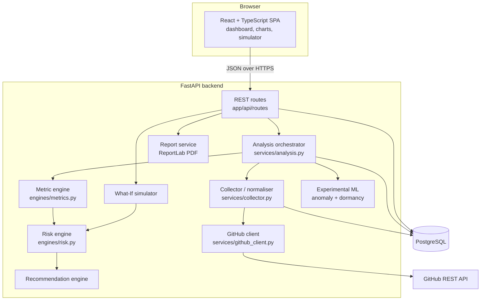

# 08 — System Architecture

## Layered view



## Design principles
1. **Pure engines, impure edges.** Metrics, risk, recommendations and simulation are pure functions (input → output, no I/O). They are trivial to unit-test and reason about. Only the GitHub client, collector, and routes touch the network or database.
2. **Store raw once, compute per run.** Raw GitHub entities are upserted per project; every run stores its own metrics, assessment, factors and recommendations — so history is exact and repeated analyses do not duplicate raw data.
3. **Explainability by construction.** The additive risk model means the explanation *is* the calculation.
4. **Honest outputs.** Nulls instead of guesses; truncation flags; disclaimers; experimental ML separated from the score.
5. **Asynchronous analysis.** `POST /analyze` returns 202 with a run id; the work runs as a FastAPI background task with its own DB session; the UI polls run status.

## Key decisions and alternatives considered
| Decision | Alternative | Why |
|---|---|---|
| FastAPI background task | Celery + Redis queue | Fewer moving parts for an MVP; limitation (runs lost on restart) handled by marking stale runs FAILED after 15 min |
| REST | GraphQL | Simpler to test and document; OpenAPI generated automatically |
| Additive rule engine as primary | ML score | No defensible risk labels (docs/07) |
| ReportLab PDF | HTML-to-PDF (headless browser) | Pure Python, no browser in the container |
| Same-origin nginx proxy | Direct CORS calls | Browser never needs CORS in Docker; CORS still configured for split deployments |
| No authentication | JWT login | Single-team tool on public data (docs/12) |

## Module map
```
backend/app
├── main.py                 app factory, middleware, error handlers
├── core/                   config (env vars), database, time helpers
├── models/entities.py      13 SQLAlchemy tables
├── schemas/api.py          Pydantic request/response models
├── api/deps.py             dependencies, APIError, audit helper
├── api/routes/projects.py  project/analysis/metrics/risk/history/simulate/report endpoints
├── api/routes/meta.py      health, metric definitions, risk model, model card
├── services/               github_client, collector, analysis orchestrator, report
├── engines/                metrics, risk_config, risk, recommendations, simulator
└── ml/                     features, anomaly, dormancy (+ artifacts/)
frontend/src
├── App.tsx                 layout, project selection
├── components/             Sidebar, ProjectView, ScoreStrip, *Tab components, ui primitives
└── lib/                    api client, types, formatting, useAsync hook
```

See `docs/diagrams/` for DFDs, UML and deployment diagrams.
