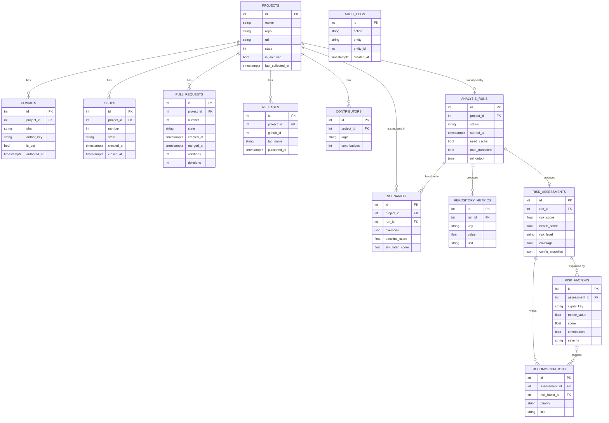

# Entity–Relationship Diagram

```mermaid
erDiagram
  PROJECTS ||--o{ COMMITS : has
  PROJECTS ||--o{ ISSUES : has
  PROJECTS ||--o{ PULL_REQUESTS : has
  PROJECTS ||--o{ RELEASES : has
  PROJECTS ||--o{ CONTRIBUTORS : has
  PROJECTS ||--o{ ANALYSIS_RUNS : "is analysed by"
  PROJECTS ||--o{ SCENARIOS : "is simulated in"
  ANALYSIS_RUNS ||--o{ REPOSITORY_METRICS : produces
  ANALYSIS_RUNS ||--o| RISK_ASSESSMENTS : produces
  ANALYSIS_RUNS ||--o{ SCENARIOS : "baseline for"
  RISK_ASSESSMENTS ||--o{ RISK_FACTORS : "explained by"
  RISK_ASSESSMENTS ||--o{ RECOMMENDATIONS : yields
  RISK_FACTORS |o--o{ RECOMMENDATIONS : triggers

  PROJECTS { int id PK
    string owner
    string repo
    string url
    int stars
    bool is_archived
    timestamptz last_collected_at }
  COMMITS { int id PK
    int project_id FK
    string sha
    string author_key
    bool is_bot
    timestamptz authored_at }
  ISSUES { int id PK
    int project_id FK
    int number
    string state
    timestamptz created_at
    timestamptz closed_at }
  PULL_REQUESTS { int id PK
    int project_id FK
    int number
    string state
    timestamptz created_at
    timestamptz merged_at
    int additions
    int deletions }
  RELEASES { int id PK
    int project_id FK
    int github_id
    string tag_name
    timestamptz published_at }
  CONTRIBUTORS { int id PK
    int project_id FK
    string login
    int contributions }
  ANALYSIS_RUNS { int id PK
    int project_id FK
    string status
    timestamptz started_at
    bool used_cache
    bool data_truncated
    json ml_output }
  REPOSITORY_METRICS { int id PK
    int run_id FK
    string key
    float value
    string unit }
  RISK_ASSESSMENTS { int id PK
    int run_id FK
    float risk_score
    float health_score
    string risk_level
    float coverage
    json config_snapshot }
  RISK_FACTORS { int id PK
    int assessment_id FK
    string signal_key
    float metric_value
    float score
    float contribution
    string severity }
  RECOMMENDATIONS { int id PK
    int assessment_id FK
    int risk_factor_id FK
    string priority
    string title }
  SCENARIOS { int id PK
    int project_id FK
    int run_id FK
    json overrides
    float baseline_score
    float simulated_score }
  AUDIT_LOGS { int id PK
    string action
    string entity
    int entity_id
    timestamptz created_at }
```
