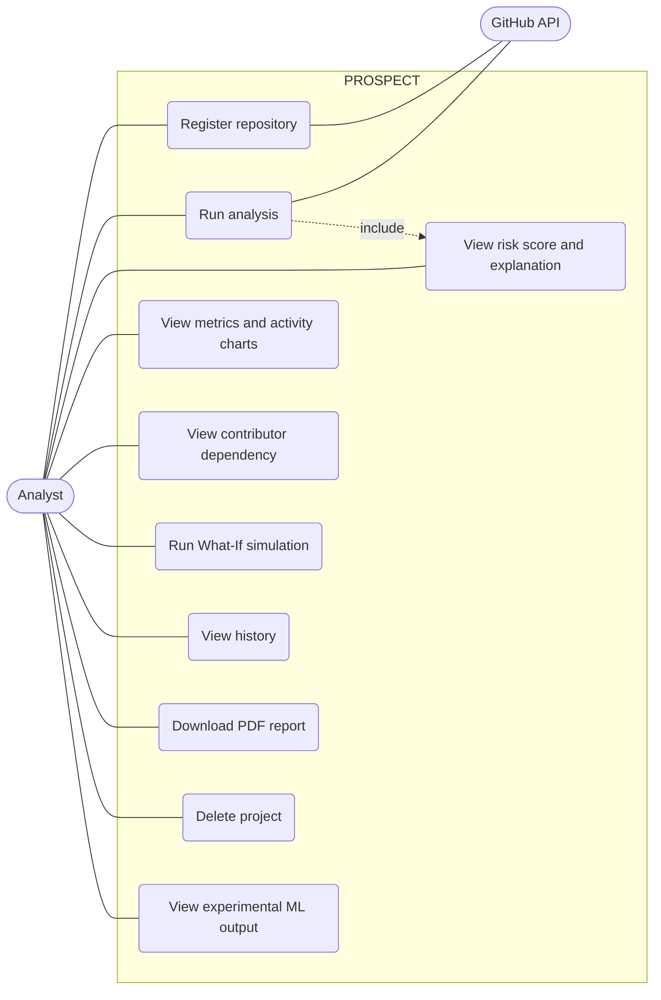
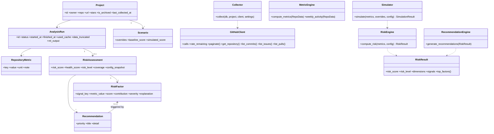
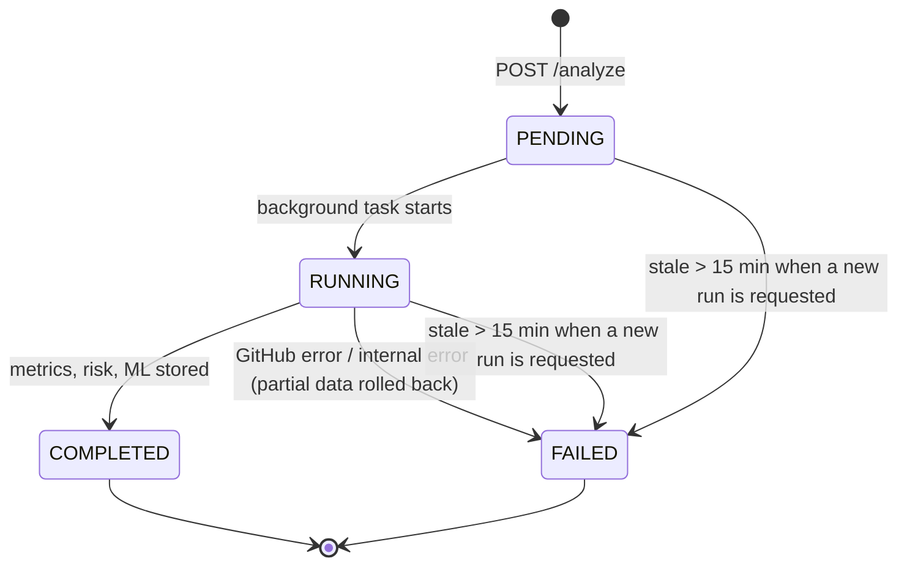
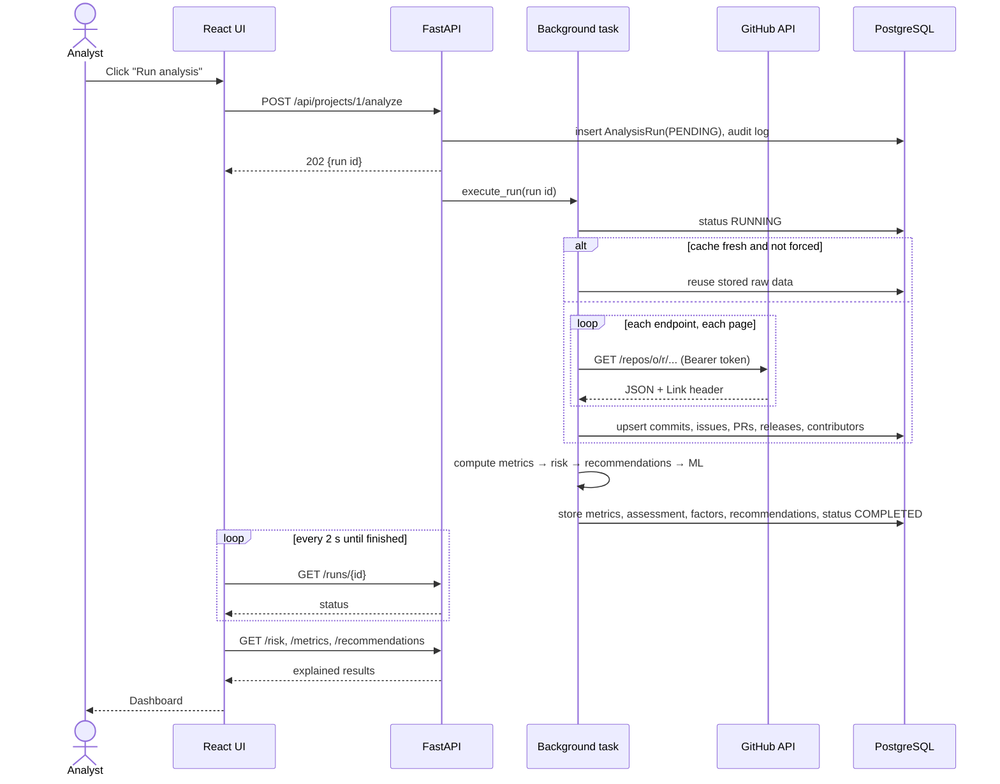
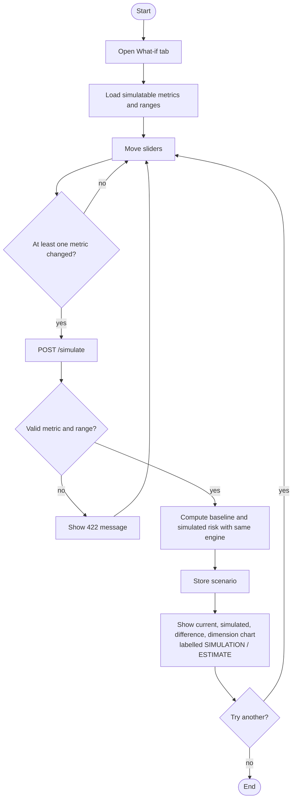
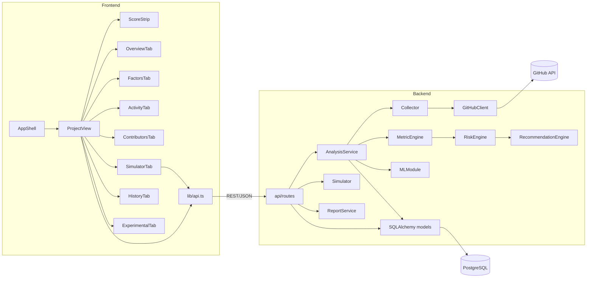
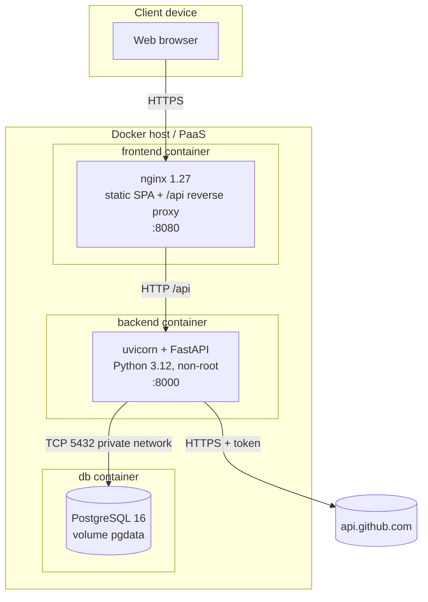

# UML Diagrams

## Use case diagram

## Class diagram (core domain and engines)

## State chart — AnalysisRun

## Sequence diagram — run an analysis

## Activity diagram — What-If simulation

## Component diagram

## Deployment diagram

